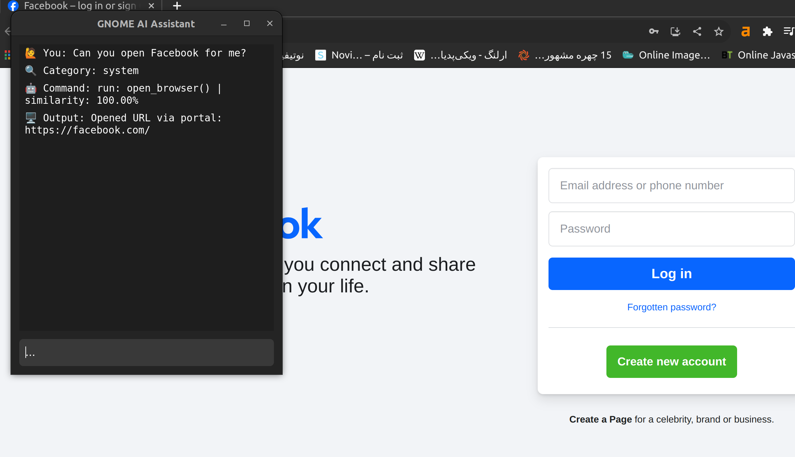
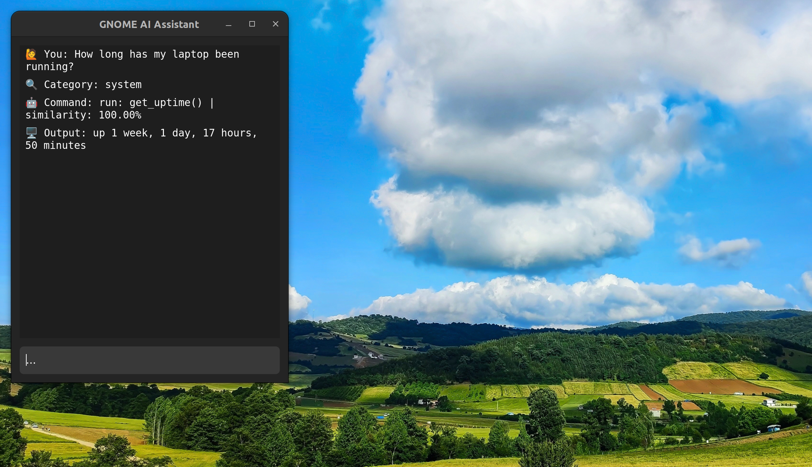
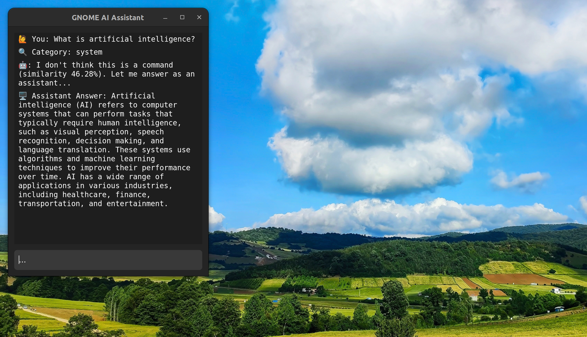

# Assistant

A simple yet powerful **AI-powered desktop assistant**.

Assistant lets you interact with your Linux desktop using natural language.  
Chat with the assistant, run system commands, open websites, show notifications, and more — all from a clean, native GTK 4 UI.

---

## ✨ Features

| | |
|---|---|
| 🧠 **Local AI chat** (via **Ollama**) | 🔔 **GNOME notifications** |
| 🖥️ **Natural-language system commands** | 🔎 **Flatpak-friendly** |
| 🗂️ **Smart argument extraction**<br>(e.g. “open Facebook” ⇒ `https://facebook.com`) | 🌐 **Fully offline** — no cloud needed |
| 🖌️ **GTK 4 / Adwaita UI**  |

---

## 🚀 Powered by Ollama

We rely on local Ollama models for both embeddings **and** generation:

| Purpose | Model (example) |
|---------|-----------------|
| Command understanding (embeddings) | `nomic-embed-text` |
| Chat & argument extraction | `phi:2.7b-chat` (or TinyLlama) |

```bash
# make sure the Ollama server is running
ollama serve

# pull required models
ollama pull nomic-embed-text
ollama pull phi:2.7b-chat
````

---

## 🖼️ Screenshots

| Example                                                                                                                                                                                      | Screenshot                                                                                          |                                                   |
| -------------------------------------------------------------------------------------------------------------------------------------------------------------------------------------------- | --------------------------------------------------------------------------------------------------- | ------------------------------------------------- |
| **1 · Open browser (argument extraction)**<br>**User:** *Can you open Facebook for me?*<br>                                                       |  |
| **2 · System uptime command**<br>**User:** *How long has my laptop been running?*                                        |                                                          |                                                   |
| **3 · AI chat mode**<br>**User:** *what is artificial intelligence*<br> |                                                         |                                                   |

---

## ⚙️ How it works

1. **Input** – You type a natural-language request.
2. **Embedding** – Text is embedded with `nomic-embed-text`.
3. **Command match** – Cosine similarity vs. built-in commands.
4. **If similarity ≥ 70 %**
   • Arguments are extracted with a small LLM prompt.
   • Python function executes and the result is shown.
5. **Else**
   • Request is forwarded to the chat model (`phi:2.7b-chat`).
---

## 📦 Installation (Flatpak dev build)

```bash
git clone https://github.com/azibom/assistant.git
cd assistant
flatpak-builder --user --install --force-clean build-dir org.gnome.assistant.json
```

> Requires **GNOME Platform** and **GNOME Sdk**.

---

## 🎯 Project goals

* Provide a smooth AI-assistant experience **natively on the GNOME desktop**
* Remain **fully local & offline** – no cloud APIs
* Make everyday system tasks more natural
* Be **easily extensible** with new commands
* Grow a rich **command library** (filesystem, media, networking, productivity, …)
* Support **multi-argument commands**  
  e.g. `resize image 800 × 600 as JPEG` → `resize_image(width=800, height=600, format=jpeg)`
* Enable **chained / compound requests**  
  e.g. “Open my IDE **and** generate a Fibonacci example” → sequentially run `open_ide()` → `insert_code("fibonacci")`


---

## 🤝 Code of Conduct
We follow the [GNOME Code of Conduct](https://wiki.gnome.org/Foundation/CodeOfConduct) to ensure a welcoming environment for everyone. Be kind, be respectful, and help us build something awesome and fun together. 

---

## 📝 License

Released under the **GPL-3.0-or-later**.
See [`COPYING`](COPYING) for full text.

---

## 🙏 Credits

* [Ollama](https://ollama.com/) – local LLM server
* GNOME community & GNOME Platform
* All open-source contributors

---

Enjoy using **Assistant** — your smart desktop companion!
